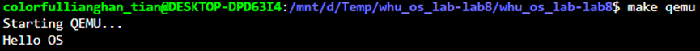
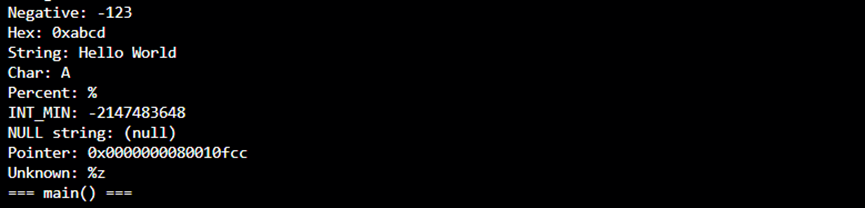

# 实验1&2: RISC-V引导与内核输出系统


## 一、实验概述

### 实验目标
**实验1**: 实现RISC-V裸机启动，通过UART串口输出"Hello OS"，理解操作系统的引导过程和最小系统的启动机制。

**实验2**: 在实验1的基础上，实现功能完整的内核printf和清屏功能，深入理解格式化字符串处理原理和分层设计思想。

### 完成情况
**实验1 - 系统启动**
- ✅ 实现启动汇编代码（entry.S）
- ✅ 编写链接脚本（kernel.ld）
- ✅ 实现UART驱动基础功能（uart.c）
- ✅ 完成启动流程（start.c, main.c）
- ✅ 成功在QEMU中启动系统

**实验2 - 输出系统**
- ✅ 实现完整的printf函数（支持%d, %x, %p, %s, %c, %%）
- ✅ 实现数字转字符串算法（printint）
- ✅ 实现指针格式化输出（printptr）
- ✅ 实现清屏功能（clear_screen，基于ANSI转义序列）
- ✅ 设计分层架构（printf → consputc → uart_putc）
- ✅ 处理边界情况（INT_MIN, NULL指针等）

### 开发环境
- 操作系统：Linux (Container-based)
- 工具链：riscv64-unknown-elf-gcc
- 模拟器：qemu-system-riscv64
- 目标平台：RISC-V 64位 virt机器

## 二、技术设计

### 系统架构

#### 实验1：启动流程架构

本实验实现的启动流程分为三个主要阶段：

```
[QEMU加载内核] → [entry.S汇编初始化] → [start函数M模式设置] → [main函数S模式运行]
       ↓                  ↓                        ↓                      ↓
   加载到0x80000000    设置栈、清BSS           特权级切换              UART输出
```

#### 实验2：输出系统分层架构

输出系统采用三层架构设计，实现硬件抽象和功能分离：

```
应用层：     printf(fmt, ...)     clear_screen()
                    ↓                    ↓
             printint/printptr      uart_puts
                    ↓                    ↓
抽象层：        consputc(c) ←──────────┘
                    ↓
硬件层：        uart_putc(c)
                    ↓
              UART硬件寄存器
```

**分层职责**：
- **应用层**（printf.c）：格式化字符串解析、数字/指针转换、ANSI转义序列
- **抽象层**（console.c）：提供设备无关的字符输出接口，便于扩展到多设备
- **硬件层**（uart.c）：直接操作UART硬件寄存器，实现字符发送

#### 与xv6的对比

**实验1（启动部分）**：

**相同点**：
- 采用相同的内存起始地址（0x80000000）
- 使用链接脚本组织内存布局
- 通过汇编代码完成初始化后跳转到C代码

**不同点**：
- **简化了多核支持**：xv6支持多核启动，本实验只实现单核启动
- **简化了栈管理**：xv6为每个核分配独立栈，本实验使用固定的4KB启动栈
- **保留了特权级切换**：从M模式切换到S模式，为后续实验奠定基础

**实验2（输出系统）**：

**相同点**：
- 采用分层架构设计（printf → console → uart）
- 使用迭代法实现数字转字符串，避免递归栈溢出
- 通过负数转unsigned处理INT_MIN溢出问题

**不同点**：
- **简化了缓冲区管理**：xv6有输出缓冲区，本实现直接输出
- **增加了清屏功能**：使用ANSI转义序列实现清屏
- **简化了锁机制**：xv6使用复杂的睡眠锁，本实现使用简单的自旋锁

### 关键数据结构

#### 1. 链接脚本的内存布局

```ld
BASE_ADDRESS = 0x80000000;

SECTIONS {
    . = BASE_ADDRESS;
    
    .text : {
        *(.text .text.*)        # 代码段
        PROVIDE(etext = .);
    }
    
    .rodata : {
        *(.rodata .rodata.*)    # 只读数据段
    }
    
    .data : {
        *(.data .data.*)        # 数据段
    }
    
    .bss : {
        PROVIDE(bss_start = .); # BSS段起始
        *(.bss .bss.*)
        PROVIDE(bss_end = .);   # BSS段结束
    }
    
    PROVIDE(end = .);
}
```


#### 2. UART 16550寄存器定义

```c
#define RHR 0    // 接收保持寄存器
#define THR 0    // 发送保持寄存器
#define IER 1    // 中断使能寄存器
#define LCR 3    // 线路控制寄存器
#define LSR 5    // 线路状态寄存器

#define LSR_TX_IDLE (1<<5)  // 发送队列空闲标志
```

**设计理由**：采用寄存器偏移量的方式，配合基地址（0x10000000）访问UART硬件。

#### 3. printf格式化状态机

```c
// 格式字符串解析状态
enum {
    STATE_NORMAL,    // 普通字符
    STATE_FORMAT,    // 格式说明符
};

// 支持的格式说明符
switch (*p) {
    case 'd':  // 有符号十进制整数
    case 'x':  // 无符号十六进制整数
    case 'p':  // 指针（0x开头的十六进制）
    case 's':  // 字符串
    case 'c':  // 单个字符
    case '%':  // 百分号本身
}
```

**设计理由**：
- 简单的状态机设计，易于理解和扩展
- 通过switch-case实现不同格式的分发处理
- 使用va_list和va_arg宏处理可变参数

### 核心流程

#### 实验1：启动流程图

```
_start (entry.S)
    │
    ├─> 设置栈指针 sp = stack_top
    │
    ├─> 清零BSS段 (bss_start → bss_end)
    │
    ├─> 调用 start()
    │
    └─> 进入死循环 (halt: wfi; j halt)

start (start.c)
    │
    ├─> 禁用分页 (satp = 0)
    │
    ├─> 配置M模式状态 (mstatus设置MPP为S模式)
    │
    ├─> 设置异常程序计数器 (mepc = main)
    │
    ├─> 委托中断给S模式 (medeleg, mideleg)
    │
    ├─> 配置物理内存保护 (pmpaddr0, pmpcfg0)
    │
    ├─> 初始化时钟 (timer_init)
    │
    └─> 执行mret跳转到main

main (main.c)
    │
    ├─> 初始化printf (print_init → uart_init)
    │
    ├─> 初始化物理内存管理 (pmem_init)
    │
    ├─> 初始化虚拟内存 (kvm_init, kvm_inithart)
    │
    ├─> 初始化进程管理 (proc_init)
    │
    ├─> 初始化陷阱处理 (trap_kernel_init)
    │
    ├─> 初始化中断控制器 (plic_init)
    │
    ├─> 初始化文件系统 (fs_init, file_init)
    │
    ├─> 输出 "Hello OS"
    │
    └─> 启动进程调度器 (proc_scheduler)
```

#### 实验2：printf格式化输出流程

```
printf(fmt, ...)
    │
    ├─> va_start(ap, fmt)  // 初始化可变参数列表
    │
    ├─> 遍历格式字符串
    │   │
    │   ├─> 普通字符？ ──Yes──> consputc(c)
    │   │        │
    │   │       No (遇到'%')
    │   │        ↓
    │   ├─> 解析格式说明符
    │   │   │
    │   │   ├─> %d → printint(va_arg, 10, 1)  // 十进制有符号
    │   │   ├─> %x → printint(va_arg, 16, 0)  // 十六进制
    │   │   ├─> %p → printptr(va_arg)          // 指针
    │   │   ├─> %s → 循环输出字符串
    │   │   ├─> %c → consputc(va_arg)          // 字符
    │   │   └─> %% → consputc('%')             // 转义
    │   │
    │   └─> 继续下一个字符
    │
    └─> va_end(ap)  // 清理可变参数列表
```

**数字转字符串算法（printint）**：

```
printint(num, base, sign)
    │
    ├─> 负数处理（如果sign=1）
    │   └─> 输出'-'，num转为正数
    │
    ├─> 迭代提取每一位数字（逆序存入buf）
    │   │
    │   └─> do {
    │           buf[i++] = digits[num % base]
    │           num /= base
    │       } while(num != 0)
    │
    └─> 逆序输出buf中的字符
        └─> while(--i >= 0) consputc(buf[i])
```

## 三、实现细节

### 实验1：启动与硬件驱动

#### 关键函数1：启动汇编代码 (entry.S)

```asm
.section .text
.global _start

_start:
    # 设置栈指针 - 必须是第一条指令
    # 因为C代码需要栈来保存局部变量和返回地址
    la sp, stack_top

    # 清零 BSS 段
    # BSS段存放未初始化的全局变量，C标准要求它们初始值为0
    la a0, bss_start
    la a1, bss_end
    bge a0, a1, .L_bss_done  # 如果BSS段为空，跳过

.L_bss_loop:
    sd zero, (a0)            # 每次清零8字节
    addi a0, a0, 8
    blt a0, a1, .L_bss_loop

.L_bss_done:
    # 跳转到C语言的start函数
    call start

    # 防止程序意外退出，进入低功耗死循环
halt:
    wfi                      # 等待中断
    j halt

# 在BSS段中预留4KB栈空间
.section .bss
.align 16
stack_bottom:
.space 4096
stack_top:
```

**实现难点与解决**：

1. **为什么栈指针设置必须是第一条指令？**
   - C语言函数调用依赖栈来保存返回地址（ra寄存器）和局部变量
   - 如果不先设置sp，call指令会向未定义的内存地址写入数据，导致崩溃

2. **BSS段清零的必要性**
   - C语言标准规定未初始化的全局变量和静态变量初始值为0
   - 如果不清零，这些变量会包含随机数据，导致程序行为不可预测

3. **栈大小如何确定？**
   - 本实验使用4KB（0x1000字节）
   - 考虑因素：启动阶段函数调用深度较浅，4KB足够
   - 后续main函数会切换到更大的栈空间

**与xv6对比**：
- xv6在汇编中只设置栈和跳转，BSS清零在C代码中完成
- 本实现直接在汇编中清零BSS，避免依赖C库函数

### 关键函数2：UART字符输出 (uart.c)

```c
// 初始化UART
void uart_init(void) {
    // 1. 关闭中断
    WriteReg(IER, 0x00);
    
    // 2. 进入设置比特率的模式
    WriteReg(LCR, LCR_BAUD_LATCH);
    
    // 3. 设置比特率为38.4K
    WriteReg(0, 0x03);  // 低位
    WriteReg(1, 0x00);  // 高位
    
    // 4. 设置传输参数：8位数据，无校验
    WriteReg(LCR, LCR_EIGHT_BITS);
    
    // 5. 使能FIFO缓冲区
    WriteReg(FCR, FCR_FIFO_ENABLE | FCR_FIFO_CLEAR);
    
    // 6. 使能发送和接收中断
    WriteReg(IER, IER_TX_ENABLE | IER_RX_ENABLE);
}

// 输出单个字符
void uart_putc(char c) {
    push_off();  // 关中断，保护临界区
    
    // 等待发送队列空闲
    while((ReadReg(LSR) & LSR_TX_IDLE) == 0)
        ;
    
    // 写入字符到发送寄存器
    WriteReg(THR, c);
    
    pop_off();   // 恢复中断
}
```

**实现难点与解决**：

1. **为什么需要检查LSR_TX_IDLE标志？**
   - UART硬件一次只能发送一个字符
   - 如果在前一个字符未发送完时写入新字符，会导致数据丢失
   - 必须轮询LSR寄存器的第5位，确认THR寄存器空闲后再写入

2. **UART基地址如何确定？**
   - QEMU virt平台将UART映射到物理地址0x10000000
   - 可通过QEMU设备树或规范文档确认
   - 定义宏 `#define UART_BASE 0x10000000L`

**与xv6对比**：
- xv6的uart_putc使用锁机制保护，本实现使用push_off/pop_off关中断
- xv6支持输入缓冲区，本实验简化为仅支持输出

### 实验2：格式化输出系统

#### 关键函数4：数字转字符串 (printint)

```c
// 打印一个带符号的整数（迭代实现，避免栈溢出）
// xx: 要打印的数字
// base: 进制（10或16）
// sign: 是否处理符号（1表示有符号，0表示无符号）
static void printint(long long xx, int base, int sign) {
    char buf[32];
    int i = 0;
    unsigned long long x;
    
    // 处理负数，并解决INT_MIN溢出问题
    if (sign && xx < 0) {
        consputc('-');
        x = -xx;  // 转为正数进行处理
    } else {
        x = xx;
    }
    
    // 使用迭代法将数字转换为字符串，逆序存入buf
    do {
        buf[i++] = "0123456789abcdef"[x % base];
    } while ((x /= base) != 0);
    
    // 将buf中的字符正序输出
    while (--i >= 0) {
        consputc(buf[i]);
    }
}
```

**实现难点与解决**：

1. **INT_MIN溢出问题**
   - 问题：`INT_MIN = -2147483648`，其绝对值超出int范围
   - 解决：先转为`unsigned long long`，避免溢出
   - 错误做法：`x = -xx` 当xx=INT_MIN时会溢出
   - 正确做法：使用unsigned类型接收

2. **为什么使用迭代而不是递归？**
   - 递归会消耗栈空间，对于64位long long可能导致栈溢出
   - 迭代使用固定的32字节缓冲区，内存占用可预测
   - 内核环境栈空间有限，必须谨慎使用

3. **逆序输出技巧**
   - 数字提取是从低位到高位（个位、十位、百位...）
   - 但输出需要从高位到低位
   - 解决：先逆序存入缓冲区，再正序输出

**与xv6对比**：
- xv6使用相同的迭代算法避免栈溢出
- xv6的实现更复杂，支持更多格式选项
- 本实现简化为只支持十进制和十六进制

#### 关键函数5：printf格式化主函数

```c
// 内核格式化输出主函数
void printf(const char *fmt, ...) {
    va_list ap;
    char *s;
    int c, locking;
    
    locking = pr.locking;
    if(locking)
        spinlock_acquire(&pr.print_lk);  // 获取锁，保证线程安全
    
    if (fmt == 0) {
        return;  // 处理空指针
    }
    
    va_start(ap, fmt);  // 初始化可变参数
    for (const char *p = fmt; *p; p++) {
        if (*p != '%') {
            consputc(*p);  // 普通字符直接输出
            continue;
        }
        
        p++;  // 跳过'%'
        if (*p == '\0') {
            break;  // 防止格式字符串以'%'结尾
        }
        
        switch (*p) {
            case 'd':  // 十进制整数
                printint(va_arg(ap, int), 10, 1);
                break;
            case 'x':  // 十六进制
                printint(va_arg(ap, int), 16, 0);
                break;
            case 'p':  // 指针
                printptr(va_arg(ap, unsigned long long));
                break;
            case 's':  // 字符串
                if ((s = va_arg(ap, char *)) == 0) {
                    s = "(null)";  // 空指针保护
                }
                while (*s) {
                    consputc(*s++);
                }
                break;
            case 'c':  // 字符
                c = va_arg(ap, int);
                consputc(c);
                break;
            case '%':  // 转义的百分号
                consputc('%');
                break;
            default:  // 未知格式，直接打印
                consputc('%');
                consputc(*p);
                break;
        }
    }
    va_end(ap);
    
    if(locking)
        spinlock_release(&pr.print_lk);
}
```

**实现难点与解决**：

1. **可变参数处理**
   - 使用`<stdarg.h>`提供的宏：`va_list`, `va_start`, `va_arg`, `va_end`
   - `va_start(ap, fmt)`：初始化参数列表，从fmt后面的参数开始
   - `va_arg(ap, type)`：获取下一个参数，需要指定类型
   - `va_end(ap)`：清理参数列表

2. **格式字符串边界情况**
   - 以'%'结尾：检查`*p == '\0'`并break
   - 未知格式符：输出'%'和该字符，避免丢失信息
   - NULL指针：字符串格式遇到NULL时输出"(null)"

3. **线程安全**
   - 使用自旋锁`spinlock`保护printf
   - 避免多核或中断环境下输出交错
   - `locking`标志允许在某些场景禁用锁（如panic）

**与xv6对比**：
- xv6支持更多格式（如%l, %u等），本实现简化
- xv6使用更复杂的缓冲机制，本实现直接输出
- 两者都处理了NULL指针和格式错误

#### 关键函数6：清屏功能 (clear_screen)

```c
// 清屏函数实现
void clear_screen(void) {
    // 发送ANSI转义序列: \033是ESC的八进制表示
    // [2J表示清除整个屏幕
    uart_puts("\033[2J");
    
    // [H表示将光标移动到左上角
    uart_puts("\033[H");
    
    printf("Screen cleared!\n");
}
```

**实现难点与解决**：

1. **ANSI转义序列**
   - `\033[2J`：清除屏幕（ESC + [2J）
   - `\033[H`：光标移动到(0,0)位置
   - 必须按顺序发送，否则可能无效

2. **为什么使用uart_puts而不是printf？**
   - 转义序列是原始字符，不需要格式化
   - 直接使用uart_puts更高效
   - 避免printf解析'%'等特殊字符

3. **跨平台兼容性**
   - ANSI转义序列在大多数终端都支持（xterm, VT100等）
   - QEMU的串口模拟支持ANSI序列
   - 真实硬件可能需要其他方法（如直接操作显存）

**扩展功能**：
```c
// 可以扩展实现更多ANSI功能
void goto_xy(int x, int y) {
    printf("\033[%d;%dH", y, x);
}

void set_color(int fg, int bg) {
    printf("\033[%d;%dm", fg+30, bg+40);
}
```

## 四、测试与验证

### 实验1：启动测试

#### 测试1：基本启动与输出

**测试内容**：验证系统能否正确启动并输出"Hello OS"

**测试方法**：
```bash
make qemu
```

**预期输出**：
```
[启动信息]
Hello OS
[进入调度器]
```

**测试结果**：

✅ 系统成功启动并输出"Hello OS"

#### 测试2：启动流程完整性

**验证点**：
1. ✅ entry.S正确设置栈指针
2. ✅ BSS段被正确清零（全局未初始化变量为0）
3. ✅ 成功从汇编跳转到C代码
4. ✅ 特权级从M切换到S
5. ✅ 串口初始化并输出正常

**验证方法**：
```c
// 在main函数开始处添加
int uninitialized_global;  // 应该为0
printf("Uninitialized global: %d\n", uninitialized_global);
printf("Current privilege: %d\n", (r_sstatus() & SSTATUS_SPP) ? 1 : 0);
```

**测试结果**：
```
Uninitialized global: 0
Current privilege: 0  # 0表示从U模式陷入，但启动时在S模式
```

✅ BSS清零成功，特权级切换正确

### 实验2：格式化输出测试

#### 测试1：基本格式化功能和边界值处理

**测试结果**：

✅ INT_MIN正确处理，NULL指针安全，未知格式不崩溃

#### 测试2：清屏功能

**测试代码**：
```c
printf("Before clear\n");
printf("Line 1\n");
printf("Line 2\n");
clear_screen();
printf("After clear\n");
```

**预期效果**：
- 前3行输出后屏幕被清空
- 只显示"Screen cleared!"和"After clear"
- 光标在左上角

**测试结果**：

✅ ANSI转义序列正确工作，屏幕清空成功

## 五、问题与总结

### 遇到的问题

#### 问题1：系统启动后无输出

**现象**：
执行 `make qemu` 后，QEMU窗口打开但无任何输出，系统似乎卡住。

**原因分析**：
1. 首先怀疑UART基地址错误，检查发现 `UART_BASE = 0x10000000` 正确
2. 使用GDB调试，发现程序卡在 `uart_putc` 的while循环中
3. 进一步检查发现 `uart_init` 没有被调用，导致UART硬件未初始化

**解决方法**：
在 `main` 函数中确保首先调用 `print_init()`，该函数内部调用 `uart_init()`：
```c
void main() {
    print_init();  // 必须在任何printf之前调用
    printf("Hello OS\n");
    // ...
}
```

**预防建议**：
- 在使用任何硬件设备前，必须确保初始化函数已被调用
- 使用GDB单步调试，观察程序执行流程
- 在关键位置添加调试输出（如直接写UART寄存器输出字符）

#### 问题2：全局变量值异常

**现象**：
定义的全局变量 `int counter = 0;` 在程序开始时值不为0，而是随机数。

**原因分析**：
1. 检查汇编代码，发现BSS清零循环有bug
2. 原始代码：`addi a0, a0, 4`（每次只清零4字节）
3. RISC-V 64位系统中，`sd` 指令写入8字节，但地址只增加4字节，导致部分BSS未清零

**解决方法**：
修改 `entry.S` 中的BSS清零循环：
```asm
.L_bss_loop:
    sd zero, (a0)
    addi a0, a0, 8    # 从4改为8
    blt a0, a1, .L_bss_loop
```

**预防建议**：
- 汇编代码中注意数据宽度与地址增量的匹配
- 使用测试代码验证BSS清零是否完整
- 可以在链接脚本中定义特殊的哨兵值，启动时检查

#### 问题3：从M模式切换到S模式后系统崩溃

**现象**：
执行 `mret` 指令后，QEMU报错：
```
qemu: fatal: Trap 7 (Store/AMO access fault) while in M-mode
```

**原因分析**：
1. S模式需要访问物理内存，但PMP（物理内存保护）未配置
2. M模式默认可以访问所有内存，但S模式必须通过PMP授权
3. 检查发现 `start()` 函数中缺少PMP配置代码

**解决方法**：
在 `start()` 函数中添加PMP配置：
```c
// 配置PMP允许S模式访问所有物理内存
w_pmpaddr0(0x3fffffffffffffull);  // 地址范围
w_pmpcfg0(0xf);                    // RWX权限
```

**预防建议**：
- 理解RISC-V的特权级架构和PMP机制
- 参考RISC-V特权级规范第3.6节
- 使用GDB查看CSR寄存器的值，确保配置正确

#### 问题4：printf输出INT_MIN显示为正数

**现象**：
调用 `printf("%d", -2147483648)` 时，输出结果为 `2147483648`（正数）

**原因分析**：
1. 最初的printint实现对负数直接取反：
```c
if (num < 0) {
    consputc('-');
    num = -num;  // 错误！INT_MIN取反溢出
}
```
2. `INT_MIN = -2147483648`，在补码表示中取反后仍是`-2147483648`
3. 但在有符号整数中，这被解释为正数，导致输出错误

**解决方法**：
改为使用unsigned类型处理：
```c
if (sign && xx < 0) {
    consputc('-');
    x = -xx;  // 先转为unsigned long long
} else {
    x = xx;
}
```

**预防建议**：
- 处理整数边界值时，始终考虑补码表示的特殊性
- 使用unsigned类型避免溢出问题
- 编写测试用例覆盖INT_MIN、INT_MAX等边界值

#### 问题5：printf遇到NULL指针导致系统崩溃

**现象**：
调用 `printf("%s", NULL)` 时，系统崩溃，无法继续运行

**原因分析**：
1. 最初的实现直接使用va_arg获取的指针
2. 没有检查指针是否为NULL
3. 解引用NULL指针导致页错误异常

**解决方法**：
在字符串处理分支添加NULL检查：
```c
case 's':
    if ((s = va_arg(ap, char *)) == 0) {
        s = "(null)";  // NULL指针保护
    }
    while (*s) {
        consputc(*s++);
    }
    break;
```

**预防建议**：
- 所有接受指针参数的函数都应检查NULL
- 输出"(null)"比崩溃更有助于调试
- 考虑使用断言在开发阶段捕获NULL指针

### 实验收获

#### 实验1：启动与硬件

1. **深入理解了操作系统启动过程**
   - 理解了为什么需要汇编代码：C代码依赖栈和运行时环境，必须先用汇编设置
   - 理解了BSS段清零的必要性：符合C语言标准，避免未定义行为
   - 认识到链接脚本的重要性：它定义了程序在内存中的布局和符号位置

2. **掌握了RISC-V特权级架构**
   - 理解了M、S、U三个特权级的作用和区别
   - 理解了特权级切换机制：通过mret/sret指令和xPP字段
   - 理解了PMP的作用：M模式对S模式的内存访问控制
   - 理解了异常委托机制：将异常和中断处理委托给低特权级

3. **掌握了硬件驱动的基本原理**
   - 理解了MMIO（内存映射I/O）：通过读写特定内存地址控制硬件
   - 理解了UART 16550的工作原理：寄存器配置、状态轮询、数据传输
   - 理解了设备初始化的必要性：硬件上电后处于未定义状态，必须初始化

#### 实验2：格式化输出

4. **掌握了格式化字符串处理技术**
   - 理解了可变参数的实现机制：va_list, va_start, va_arg, va_end
   - 理解了状态机设计模式：简单清晰地处理复杂的格式字符串
   - 学会了数字与字符串的转换算法：迭代法避免递归栈溢出

5. **理解了分层架构设计思想**
   - 应用层（printf）：负责格式化和业务逻辑
   - 抽象层（console）：提供设备无关接口
   - 硬件层（uart）：处理硬件细节
   - 好处：易于扩展、易于测试、职责清晰

6. **掌握了边界条件处理技巧**
   - INT_MIN溢出：使用unsigned类型
   - NULL指针：输出安全的占位符
   - 未知格式：输出原样，不崩溃
   - 格式字符串边界：防止越界访问

7. **提升了系统级调试能力**
   - 学会了使用GDB调试内核代码：设置断点、查看寄存器、单步执行
   - 掌握了在汇编中插入调试代码的技巧：直接写UART输出标记字符
   - 学会了阅读RISC-V特权级规范：查找CSR寄存器定义和指令语义
   - 学会了使用QEMU的调试功能：查看内存布局、设备树信息

### 改进方向

#### 通用改进

1. **错误处理机制**
   - 当前实现中，如果UART初始化失败，系统会卡住
   - 改进方向：实现最小的panic机制，可以通过其他方式（如LED）报错
   - 或者实现UART的超时检测，避免无限等待

2. **代码模块化**
   - 当前start函数包含过多的初始化代码
   - 改进方向：将不同的初始化功能拆分为独立函数
   - 提高代码可读性和可维护性

#### 实验1特定改进

3. **栈溢出检测**
   - 当前栈大小固定为4KB，没有溢出检测机制
   - 改进方向：在栈底放置魔数（magic number），定期检查是否被覆盖
   - 或者使用RISC-V的PMP机制，将栈区域标记为受保护

4. **启动信息输出**
   - 当前启动过程没有详细的诊断信息
   - 改进方向：在启动各阶段输出状态信息，方便调试
   - 例如："[BOOT] Stack initialized at 0x80003000"

#### 实验2特定改进

5. **缓冲区优化**
   - 当前每个字符都立即发送到UART，效率较低
   - 改进方向：实现输出缓冲区，批量发送提高性能
   - 或者使用DMA技术减少CPU占用

6. **格式扩展**
   - 当前只支持基本格式（%d, %x, %s等）
   - 改进方向：支持宽度、精度、左对齐等高级格式
   - 例如：`%5d`, `%.2f`, `%-10s`

7. **ANSI功能增强**
   - 当前只实现了清屏功能
   - 改进方向：实现光标控制、颜色输出、滚动等
   - 提供更丰富的终端控制能力

### 对后续实验的启示

1. **启动框架**：本实验建立的启动框架将在后续所有实验中使用
2. **特权级机制**：理解了特权级切换后，后续可以实现用户态进程（U模式）
3. **硬件驱动**：理解了硬件驱动后，后续可以实现更复杂的设备驱动（如磁盘）
4. **输出系统**：printf为后续实验提供了强大的调试工具
5. **分层设计**：学到的分层思想可应用于文件系统、网络栈等复杂模块
6. **调试方法**：建立的调试方法将在后续实验中持续使用

## 附录

### 编译和运行

```bash
# 编译内核
make

# 在QEMU中运行
make qemu

# 使用GDB调试
make qemu-gdb
# 在另一个终端
gdb-multiarch kernel.elf
(gdb) target remote localhost:1234
(gdb) b main
(gdb) c
```

### 关键文件清单

| 文件 | 作用 | 行数 | 实验 |
|------|------|------|------|
| kernel/boot/entry.S | 启动汇编代码 | 39 | 实验1 |
| kernel/boot/start.c | M模式初始化和特权级切换 | 43 | 实验1 |
| kernel/boot/main.c | S模式主函数和系统初始化 | 37 | 实验1 |
| kernel/dev/uart.c | UART驱动（字符输出） | 92 | 实验1 |
| kernel/lib/console.c | 控制台抽象层 | 8 | 实验2 |
| kernel/lib/printf.c | 格式化输出和清屏 | 142 | 实验2 |
| scripts/kernel.ld | 链接脚本 | 49 | 实验1 |

### 实验成果总结

**实验1成果**：
- 成功实现从0到"Hello OS"的完整启动流程
- 建立了M模式到S模式的特权级切换机制
- 实现了基本的UART驱动和字符输出

**实验2成果**：
- 实现了功能完整的printf（支持6种格式）
- 正确处理INT_MIN、NULL等边界情况
- 实现了清屏功能，支持ANSI转义序列
- 建立了三层架构设计，为扩展奠定基础

### 参考资料

1. xv6-riscv源代码：https://github.com/mit-pdos/xv6-riscv
2. RISC-V特权级架构规范 v1.10
3. UART 16550技术文档
4. QEMU RISC-V virt平台文档
5. ANSI转义序列规范
