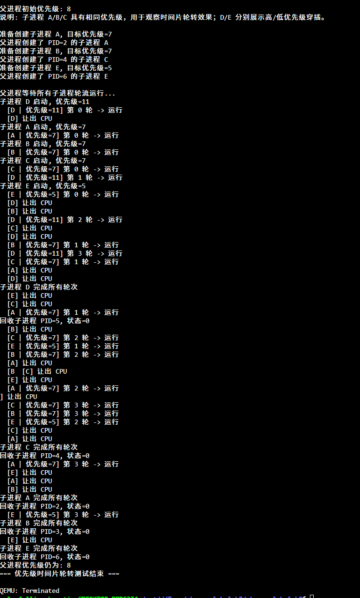

# 项目1：优先级调度系统（拓展实验报告）

**日期**：2025-12-29

## 一、实验概述

### 1.1 项目目标
本拓展项目在原有“时间片轮转（Round-Robin）”的基础上，引入**进程优先级**与**防老化（Aging）**机制，实现：

1. **实时/高优先级任务更快响应**：高优先级进程在就绪队列中获得更高的调度概率
2. **普通任务公平性保证**：低优先级进程不会长期饥饿，等待足够久后能被提升并运行
3. **整体调度效率提升**：减少“所有任务一刀切”带来的响应延迟与不必要切换

### 1.2 原始简单调度器的瓶颈分析（轮转/等权）
在仅有时间片轮转的情况下（所有 RUNNABLE 进程等权）：

- **实时任务响应上界差**：高优先级/交互任务最坏需要等待 $(N-1)\times T_{slice}$ 才能拿到 CPU（N 为就绪进程数）
- **无法表达任务重要性**：CPU 密集型任务可能与关键任务获得同等 CPU 份额
- **公平≠体验**：虽然平均公平，但对“需要快速响应”的任务不友好
- **调度开销固定**：每个时间片都要进行上下文切换与选择过程；当进程数多时，切换频繁且收益不明显

### 1.3 完成情况（结合本工程实现）
- ✅ 在 PCB 中加入优先级字段：静态优先级 `priority` + 动态加权 `priority_boost`
- ✅ 实现基于“有效优先级”的选择：`effective = priority + priority_boost`
- ✅ 实现防老化：对等待中的 RUNNABLE 进程逐步增加 boost，避免饥饿
- ✅ 提供用户态接口：`sys_setpriority()` / `sys_getpriority()`，可在用户程序中设置并验证
- ✅ 提供测试用例：`user/initcode.c` 内置“优先级时间片轮转测试”输出结果

### 1.4 开发环境
- OS：Windows（本机）
- 目标架构：RISC-V 64
- 模拟器：QEMU virt

---

## 二、技术设计

### 2.1 总体设计思路
本项目采用“**静态优先级 + 动态老化提升**”的策略。

- 静态优先级 `priority`：由用户/内核指定，表达“任务的重要性/实时性”
- 动态权重 `priority_boost`：表达“等待时间”，等待越久越可能被调度

调度时使用有效优先级：

$$
\mathrm{eff}(p)=\min\left(PRIORITY_{MAX},\ p.\mathrm{priority}+p.\mathrm{priority\_boost}\right)
$$

### 2.2 优先级范围与语义
在 [whu_os_lab-lab8/include/proc/proc.h](whu_os_lab-lab8/include/proc/proc.h) 中定义：
- `PRIORITY_MIN = 0`
- `PRIORITY_MAX = 15`
- `PRIORITY_DEFAULT = 8`

语义：**数值越大，优先级越高**。

### 2.3 防老化（Aging）策略
如果系统只按静态优先级调度，低优先级可能长期得不到运行（饥饿）。本项目引入 boost：

- 在每次调度周期结束后，对除“刚运行过的进程”以外的 RUNNABLE 进程执行：
	- `priority_boost++`，但不超过 `PRIORITY_MAX - priority`
- 被选中运行的进程：
	- 将 `priority_boost` 置 0（表示“刚得到 CPU，不需要老化补偿”）

直观效果：
- 高优先级仍然更容易被选中
- 低优先级如果一直没运行，boost 会逐步补偿，最终能追平并获得运行机会

### 2.4 调度选择规则与并列处理
调度器在所有 RUNNABLE 进程中选择有效优先级最高者：
- 先比较 `effective_priority`
- 若有效优先级相同，则用 `pid` 作为 tie-break（选择 pid 更小者）

该规则简单、确定，便于测试输出结果稳定。

### 2.5 复杂度与开销
- 每轮调度选择需要扫描进程表：时间复杂度 $O(NPROC)$
- boost 更新同样是扫描：$O(NPROC)$

与“简单轮转”相比，仍为线性扫描，但换来更好的响应性与避免饥饿的保证。

---

## 三、实现细节

### 3.1 PCB 扩展：priority / priority_boost
对应文件：
- [./include/proc/proc.h](./include/proc/proc.h)

新增字段：
- `int priority`：静态优先级
- `int priority_boost`：动态提升值

初始化逻辑：在进程创建/分配阶段把优先级设为默认值、boost 置 0（见 `kernel/proc/proc.c` 中对新建进程的初始化）。

### 3.2 fork 继承优先级
对应文件：
- `kernel/proc/proc.c`

实现要点：
- 子进程在创建时继承父进程的 `priority` 与 `priority_boost`
- 这样父进程可以“先 setpriority，再 fork”来创建指定优先级的子进程

（本项目的用户态测试就是利用这个性质实现的。）

### 3.3 有效优先级计算：effective_priority
对应文件：
- `kernel/proc/proc.c`：`effective_priority(proc_t* p)`

核心逻辑：
- `eff = p->priority + p->priority_boost`
- `eff` 上限截断到 `PRIORITY_MAX`

### 3.4 老化提升：boost_waiting_processes
对应文件：
- `kernel/proc/proc.c`：`boost_waiting_processes(proc_t* last_run)`

核心逻辑：
- 仅对 RUNNABLE 且不是 `last_run` 的进程增加 boost
- boost 最大值由 `PRIORITY_MAX - p->priority` 决定

这样保证有效优先级不会超过系统上限，同时让低优先级进程“越等越接近可运行”。

### 3.5 调度器：proc_scheduler
对应文件：
- `kernel/proc/proc.c`：`proc_scheduler()`

调度流程（概括）：
1. `intr_on()` 打开中断，避免设备无法打断导致死锁
2. 扫描进程表，挑选 RUNNABLE 且有效优先级最高的进程 `chosen`
3. 若没有可运行进程：执行 `wfi` 等待中断唤醒
4. 切换执行：
	 - `chosen->state = RUNNING`
	 - `chosen->priority_boost = 0`
	 - `swtch(&cpu->ctx, &chosen->ctx)`
5. 该轮结束后：调用 `boost_waiting_processes(last_run)` 更新其他等待进程的 boost

并发/锁：
- 扫描时短暂持有每个进程的 `p->lk`，读取状态与优先级后立即释放
- 最终选中 `chosen` 后再重新获取其锁并切换

### 3.6 用户态接口：sys_setpriority / sys_getpriority
对应文件：
- `kernel/syscall/sysfunc.c`：`sys_setprior()` / `sys_getprior()`
- `kernel/proc/proc.c`：`proc_set_priority()` / `proc_get_priority()`
- [whu_os_lab-lab8/user/syscall_wrap.h](whu_os_lab-lab8/user/syscall_wrap.h)：`sys_setpriority()` / `sys_getpriority()`
- syscall 编号：`SYS_setprior=18`、`SYS_getprior=19`（见 [whu_os_lab-lab8/include/syscall/sysnum.h](whu_os_lab-lab8/include/syscall/sysnum.h)）

实现要点：
- `proc_set_priority(priority)` 会检查范围 `[PRIORITY_MIN, PRIORITY_MAX]`
- 设置成功后将 `priority_boost` 清 0（避免“立刻设置高优先级还带着 boost”导致异常偏置）

---

## 四、测试与结果（功能验证）

### 4.1 测试用例：优先级时间片轮转测试
本工程在 [whu_os_lab-lab8/user/initcode.c](whu_os_lab-lab8/user/initcode.c) 中提供了 `priority_scheduler_test()`：

- 父进程先读取自身 `base_priority = sys_getpriority()`
- 依次创建多个子进程（A/B/C/D/E），并通过“先 `sys_setpriority(desired)` 再 `fork()`”让子进程继承目标优先级
- 每个子进程运行若干轮：
	- 打印自身标签与优先级
	- 忙等模拟负载
	- 调用 `sys_yield()` 主动让出 CPU
- 父进程最后 `wait()` 回收所有子进程并打印状态

### 4.2 预期现象与解释
- A/B/C 同优先级：应表现出“轮转”效果（输出交替出现）
- D 高优先级：更容易被调度到，输出更频繁、更靠前
- E 低优先级：开始可能较少运行，但随着 boost 增加，应逐步获得运行机会（体现防饥饿）

### 4.3 如何运行与观察
- 直接启动系统后，`initcode` 会打印 `=== 优先级时间片轮转测试 ===` 相关输出
- 观察输出顺序与频率即可验证：
	- 高优先级插队
	- 同优先级轮转
	- 低优先级最终能运行

---

## 五、实验总结

本拓展项目在原时间片调度的基础上实现了：
- **优先级调度**：通过有效优先级选择，显著改善高优先级任务的响应性
- **防老化机制**：通过 `priority_boost` 随等待增长，避免低优先级任务长期饥饿
- **可测试性**：提供 `sys_setprior/sys_getprior` 与 `initcode` 输出测试，方便验证策略是否生效

后续可进一步扩展的方向（可选）：
- 更细粒度的 aging 策略（与等待时间/阻塞原因关联）
- I/O bound 任务奖励（交互性更好）
- 多级反馈队列（MLFQ）或基于 vruntime 的 CFS 类设计

